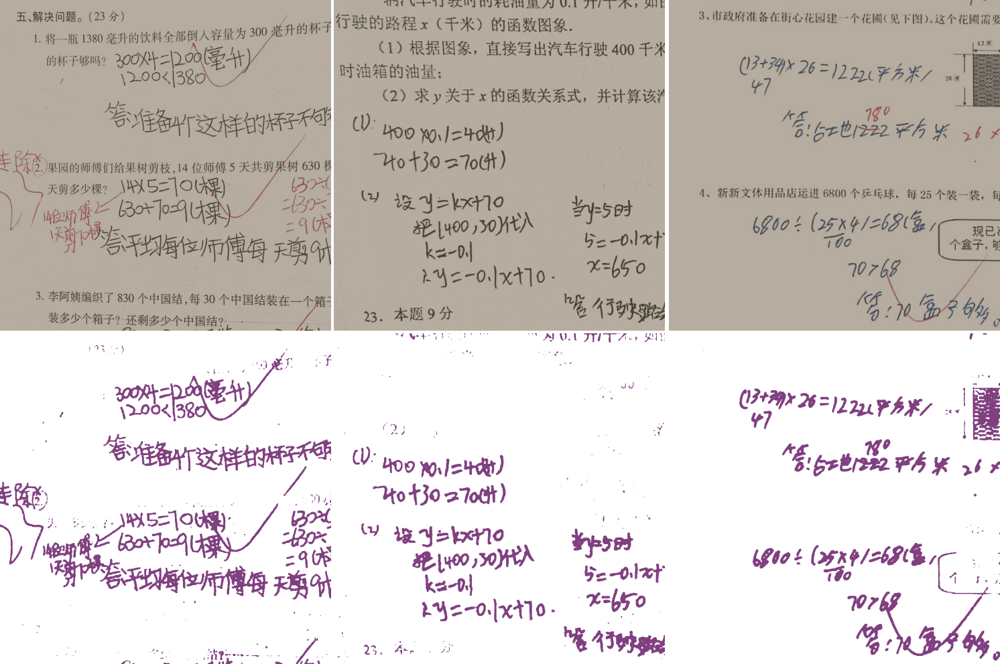

# HandWriting Eraser

## Introduction

This repo aims to use deeplabv3+ to remove the handwriting on the papers.
I define the task of removing handwriting as a segmentation task. So we use a segmentation model named Deeplabv3+ to solve this task.

## Environment

```
Python 3.7
Pytorch 1.7+
```

```
pip install -r requirements.txt
```

## Datasets And Pretrained model

We use one dataset supported by Baidu Aistdio at https://aistudio.baidu.com/aistudio/datasetdetail/121039 

You can use the flowing links to download the Pretrained model and the datasets.

Pretrained model: [https://pan.baidu.com/s/1QmCGhwpKNtdKtYoGU0YK3w?pwd=a2jh](https://pan.baidu.com/s/1QmCGhwpKNtdKtYoGU0YK3w?pwd=a2jh)

Datasets: [https://pan.baidu.com/s/1l2mQ3FLx_NAPJEh30cOeZA?pwd=05bl](https://pan.baidu.com/s/1l2mQ3FLx_NAPJEh30cOeZA?pwd=05bl)

## Optimized result

1. To optimize the segmentation result we use the tracks as follows:

2. Use the focal loss to replace the cross-entropy loss. This will help us solve the class imbalance problem in this task.
3. Use overlapping cropping to enhance the datasets.
4. Don't directly resize the image when predicting the result. Instead, I cut down the input image into many small images than predicting them separately.

## The Result of the model

| Overall Acc | Mean Acc | FreqW Acc | Mean IoU |
| ----------- | -------- | --------- | -------- |
| 0.990526    | 0.920829 | 0.982231  | 0.867805 |

### Train your own model

After downloading the ckpt and datasets, you can use :

```
python3 main.py --data_root /home/disk2/ray/datasets/HandWriting --loss_type focal_loss --gpu_id 2 --batch_size 4
```

to train your own model.

You can also use:

```
python3 main.py --data_root /home/disk2/ray/datasets/HandWriting --loss_type focal_loss --gpu_id 2 --batch_size 4 --ckpt checkpoints/best_deeplabv3plus_resnet50_os16.pth --test_only --save_val_results
```

to test your model and generate the predicted result at `./result`.

### Some results




## References

[1] [Rethinking Atrous Convolution for Semantic Image Segmentation](https://arxiv.org/abs/1706.05587)

[2] [Encoder-Decoder with Atrous Separable Convolution for Semantic Image Segmentation](https://arxiv.org/abs/1802.02611)

[3] [DeepLabV3Plus-Pytorch](https://github.com/VainF/DeepLabV3Plus-Pytorch)

