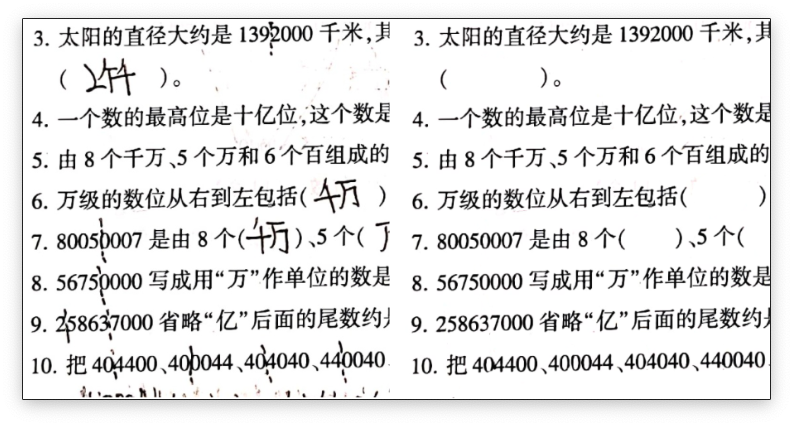

# HandWriting Eraser

## Environment

```
Python 3.7
Pytorch 1.7+
```

```
pip install requirements.txt
```

## Introduction

This repo aims to use deeplabv3+ to remove the handwriting on the papers.
I define the task of removing handwriting as a segmentation task.
So we use a segmentation model named Deeplabv3+ to solve this task.

## Optimized result

To optimize the segmentation result we use the tracks as follows:

1. Use the focal loss to replace the cross-entropy loss. This will help us solve the class imbalance problem in this task.
2. Use overlapping cropping to enhance the datasets.
3. Don't directly resize the image when predicting the result. Instead, I cut down the input image into many small images than predicting them separately.

## The Result of the model

Our model receives the 0.81 MAP in the test dataset.

### some results




